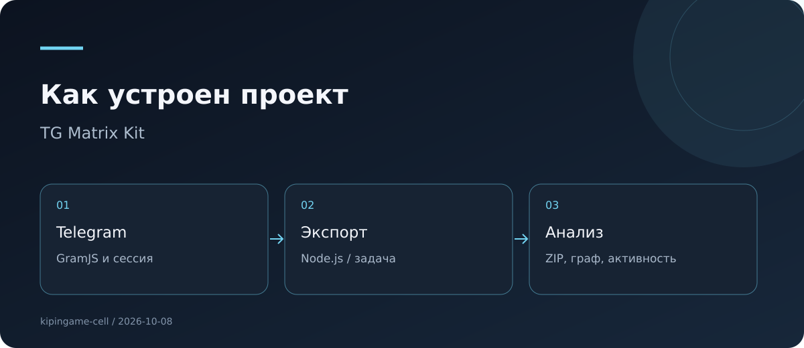

# TG Matrix Kit


**Терминал выгрузки и анализа чатов**

Локальный Node.js-терминал для выгрузки Telegram-чатов, графа связей, анализа активности и опциональных ИИ-досье.

**Тип:** Node.js · Telegram · **Версия:** 1.0.0 · **Документация сверена:** 2026-10-08.

[Версии и скачивание](docs/RELEASES.md) · [Аудит и предложения](docs/AUDIT.md) · [Исходники](https://github.com/kipingame-cell/tg-matrix-kit) · [Сборки](https://github.com/kipingame-cell/tg-matrix-kit/actions)

## Возможности

- TXT, HTML, JSON и ZIP; фильтры сообщений и участников.
- Фоновая задача выгрузки и повторное подключение к её статусу.
- Граф ответов, упоминаний и реакций, сравнение активности по периодам.
- Сессии Telegram на локальном диске; интеграция с ботом для уведомлений.
- Отдельная утилита резервирования PostgreSQL в tg_backup/.

## Запуск и проверка

```bash
npm install --ignore-scripts
python3 -c 'import secrets,pathlib; p=pathlib.Path(".env"); p.exists() or p.write_text("SESSION_SECRET="+secrets.token_urlsafe(48)+"\n")'
npm run check
npm start
```

Откройте http://127.0.0.1:3000/tg/. Сохраните `.env` с постоянным `SESSION_SECRET`: смена секрета нарушает чтение сохранённых сессий. Для Docker задайте `HOST=0.0.0.0` и публикуйте порт на `127.0.0.1`; это локальный инструмент, полноценная защита публичного API ещё не реализована.

Gemini и отправка архивов ботом — внешние интеграции: включённые функции передают выбранные данные соответствующим сервисам.

## Устройство



Основные файлы и каталоги: `server.js · src/ · public/tg/ · public/graph/ · public/heatmap/ · tg_backup/`.

## Проверенное состояние

Исходники JavaScript проверены на синтаксис. Интеграционные проверки с Telegram, PostgreSQL и внешними ИИ не выполнялись; CI отсутствовал.

## Дальнейшие улучшения

- Ввести реальную локальную авторизацию и привязку sid/экспортов к пользователю.
- Разделить обычный экспорт и явно включаемые ИИ/бот-интеграции.
- Ограничить срок хранения архивов и добавить безопасную очистку.

Полный список обнаруженных проблем: [AUDIT.md](docs/AUDIT.md).

Подробные материалы первоначальной редакции: [архив README](docs/README-previous.md).
